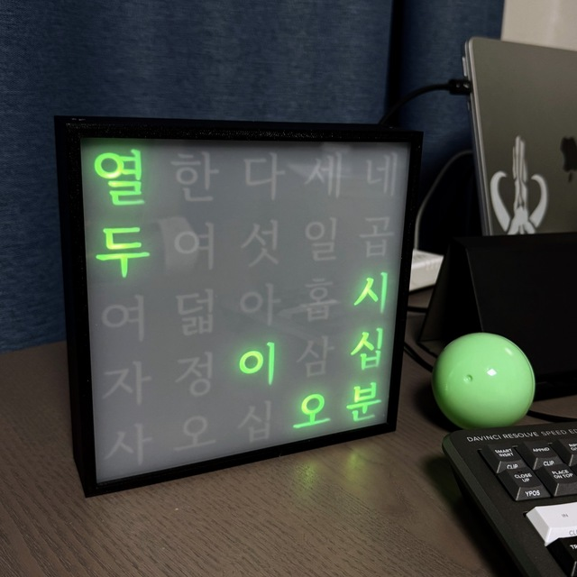

# Rusty HangulClock



HangulClock written in Rust on ESP32C3 board

Hardware:
- [sch & pcb artwork](./sch/rusty-hangulclock/) - a KiCad project
- [case 3d model](./case/)
- [panel image generator](./panel/)

## Build and flash

### Pre requirement
Install toolchain (only for one time):
```sh
cargo install espup cargo-espflash ldproxy
espup install
```

### Build and flash:
For dotstar:
```sh
make flash_dotstar
```

For neopixel ⚠️ experimental ⚠️: 
```sh
make flash_neopixel
```

### Factory reset settings:
```sh
make erase_nvs
```