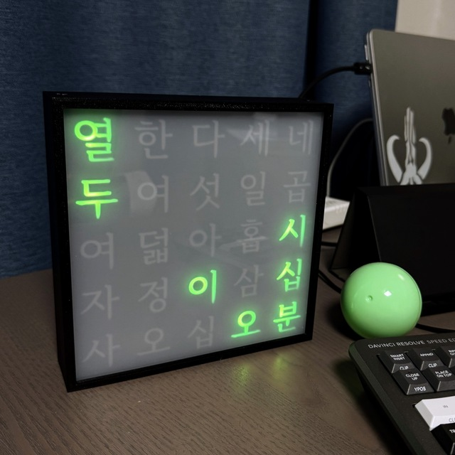

# Rusty HangulClock



HangulClock written in Rust on ESP32C3 board

Hardware:
- [sch & pcb artwork](./sch/rusty-hangulclock/) - a KiCad project
- [case 3d model](./case/)
- [panel image generator](./panel/)

## Build and flash

### Pre requirement
Install toolchain (only for one time):
```sh
cargo install espup cargo-espflash ldproxy
espup install
```

### Build and flash:
For dotstar:
```sh
make flash_dotstar
```

For neopixel ⚠️ experimental ⚠️: 
```sh
make flash_neopixel
```

### Factory reset settings:
```sh
make erase_nvs
```

## Static Analysis

This project includes comprehensive static analysis tools to ensure code quality and security:

### Available Tools

- **Clippy**: Rust linter for catching common mistakes and improving code quality
- **rustfmt**: Code formatter for consistent code style
- **cargo-audit**: Security vulnerability scanner for dependencies
- **cargo-deny**: Dependency and license checker

### Usage

Run individual checks:
```sh
# Code quality checks
make clippy

# Code formatting
make fmt
make fmt-check

# Security audit
make audit

# Dependency and license checks
make deny
```

Run all checks at once:
```sh
make check-all
```

### Configuration Files

- `.clippy.toml`: Clippy linting configuration
- `rustfmt.toml`: Code formatting rules
- `deny.toml`: Dependency and license policies

### Pre-commit Workflow

Before committing code, run:
```sh
make pre-commit
```

This will run all static analysis tools and ensure your code meets quality standards.